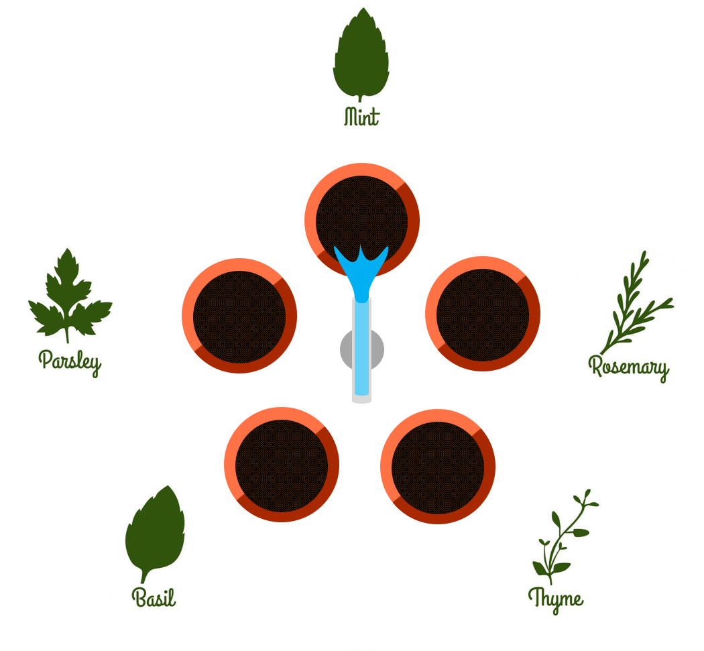

# Dragonfly Webserver

This repository includes the Tomcat RESTfull Dragonfly server.

## Rest API

All REST operations can be found on the
[REST API File](docs/REST.md)

## What is Dragonfly?

Dragonfly is an intelligent domestic watering system that allows for an autonomous and efficient way of watering plants, by knowing what a plant needs and when it needs.

The system works by disposing plants in a circular pattern and the dragonfly watering unit on the center. A motor rotates the water pipe, allowing each plant to be watered individually. Each vase has its own humidity sensor and the system has a record of which plant is sowed on which vase.

 

 

This allows a custom watering regime for different plants. All plants are also registered in Dragonfly's databases, which allows the system to know what that plant's specific water and lighting requirements.

## Running the Project

This webserver project uses *Jersey*, a Java framework that allows an easy binding for REST operations, through annotations.

The project has been run in Tomcat, but any Java web server should work.
 
 

#### Deploying to Tomcat

Using Maven terminal:
1. Start the Tomcat server
2. Execute command `mvn -e tomcat7:deploy` on Maven. This will also use the War plugin, which packs all the web content and compiled java classes.

Using IntelliJ:
1. Start the Tomcat server
2. From the Run/Debug tab, click on `Edit Configurations...`
3. Click on the plus sign to add a new run configuration and choose `Maven`
4. On the `Command Line` textbox, insert `-e tomcat7:deploy`
5. Click `OK`. After this, IntelliJ will have a clickable Run configuration
